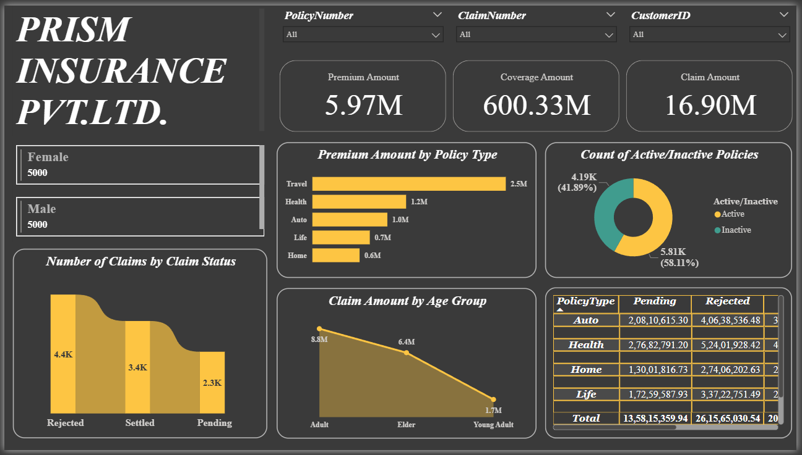

# 🏢 PRISM INSURANCE PVT. LTD. — Power BI Dashboard

## 📌 Project Overview  
This Power BI dashboard provides a detailed analysis of insurance-related data, enabling insights into premium collection, coverage distribution, claim processing, and customer demographics.  
The project helps visualize key metrics like claim status, policy activity, and premium trends across various policy types.

---

## 🔗 Dashboard Link  
[👉 Click here to view the interactive Power BI Dashboard]([https://app.powerbi.com/view?r=eyJrIjoiYTk1NmJjMGYtODA1NS00NDQyLWFjMjYtZmU5MjgxNGZlZWUzIiwidCI6IjVlNzcwZDE0LTVjYTctNDZlMC05ZTAwLTJjZGYyMTBiZDFjYSJ9](https://app.powerbi.com/view?r=eyJrIjoiNWRmM2FmYjUtNzQ0ZC00YWFlLWI5ZGEtZGUwODc2NGY4ZDAwIiwidCI6ImRkOThmY2E2LTQyZGYtNDhiYy1iYTI5LTczNzA0MzE4NWQ3NyJ9))

---

## 📁 Dataset Used  
*File:* InsuranceData.csv  

### *Dataset Columns:*
| Column Name | Description |
|--------------|-------------|
| *PolicyNumber* | Unique identifier for each policy |
| *CustomerID* | Unique ID for each customer |
| *ClaimNumber* | Unique ID for each claim |
| *Age* | Age of the policyholder |
| *Gender* | Gender of the customer |
| *CoverageAmount* | Total coverage amount of the policy |
| *PremiumAmount* | Premium paid for the policy |
| *PolicyStartDate* | Policy start date |
| *PolicyEndDate* | Policy expiry date |
| *PolicyType* | Type of insurance (Travel, Auto, Health, etc.) |
| *ClaimStatus* | Claim status (Pending, Settled, Rejected) |
| *ClaimDate* | Date when claim was made |
| *ClaimAmount* | Amount claimed by the policyholder |

---

## 📈 Overall Metrics  

| Metric | Value |
|:--------|:------|
| *Premium Amount* |  |
| *Coverage Amount* |  |
| *Claim Amount* |  |

---

## 👨‍💼 Gender Distribution  

| Gender | Count |
|:--------|:------|
| *Male* | 5000 |
| *Female* | 5000 |

---

## 💰 Premium Amount by Policy Type  

| Policy Type | Premium Amount |
|:-------------|:----------------|
| Travel | 2.5M |
| Health | 1.2M |
| Auto | 1.0M |
| Life | 0.7M |
| Home | 0.6M |

---

## 📊 Count of Active/Inactive Policies  

| Status | Count | Percentage |
|:--------|:--------|:-------------|
| *Active* | 5.81K | 58.11% |
| *Inactive* | 4.19K | 41.89% |

---

## 🧾 Number of Claims by Claim Status  

| Claim Status | Count |
|:--------------|:--------|
| *Rejected* | 4.4K |
| *Settled* | 3.4K |
| *Pending* | 2.3K |

---

## 👥 Claim Amount by Age Group  

| Age Group | Claim Amount |
|:-----------|:---------------|
| *Adult* | 8.8M |
| *Elder* | 6.4M |
| *Young Adult* | 1.7M |

---

## 📄 Policy Type vs Claim Status Summary  

| Policy Type | Pending | Rejected | Settled |
|:-------------|:--------|:----------|:--------|
| Auto | 2,08,10,615.30 | 4,06,38,536.48 | 3,24,67,231.91 |
| Health | 2,76,82,791.20 | 5,24,01,928.42 | 4,06,55,671.32 |
| Home | 1,30,01,816.73 | 2,74,06,202.63 | 1,90,43,619.51 |
| Life | 1,72,59,587.93 | 3,37,22,751.49 | 2,19,67,482.57 |
| Travel | 5,70,60,548.78 | 10,73,95,611.58 | 8,29,21,234.97 |
| *Total* | *13,58,15,359.94* | *26,15,65,030.54* | *20,70,55,240.28* |

---

## 🧠 Key Insights  

- *Travel Insurance* generates the highest premium and claim amount among all policy types.  
- *Rejected claims* outnumber settled and pending claims, indicating a need for better claim management.  
- *Adults* contribute the highest total claim amount across all age groups.  
- *Gender distribution* is perfectly balanced between male and female customers.  
- Majority of the policies are *active (58.11%)*, showing good customer engagement and renewals.  

---

## 📷 Visual Snapshots  

### 📋 Table View  

---

### 📊 Dashboard Overview  

---

## 🛠 Tools & Technologies Used  
- *Microsoft Power BI* – For visualization and data modeling  
- *Microsoft Excel / CSV* – For dataset storage and cleaning  
- *DAX* – For calculated measures and KPIs  
- *Power Query Editor* – For data transformation  

---

## 🚀 Outcomes  
- Built a dynamic dashboard that helps visualize *insurance performance metrics* clearly.  
- Improved decision-making by tracking *claim trends, premium growth, and policy engagement*.  
- Enhanced analytical understanding of *insurance data distribution across demographics and policy types*.  

---

## 📬 Author  
*Vriddhi Nirala*  
Data Analyst & Power BI Enthusiast  
🔗 [LinkedIn](https://www.linkedin.com/in/vriddhi-nirala/) •
